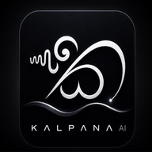

#  Kalpanā LLM | 100% Offline 3M-Token Browser Phase Attention PWA

[%20Flatline-cyan?style=for-the-badge)](https://maduperera.github.io/Kalpana-LLM/)

**Kalpanā LLM** is a revolutionary, 100% offline Progressive Web App (PWA) demonstrating continuous **3 Million+ Token Holographic Cache Ingestion & Resonant Phase Retrieval** running directly inside standard web browsers with a strictly constant **O(1) memory footprint**.

---

## 🌟 The 3M Token Breakthrough: Kalpanā vs Standard Transformers

In standard Transformer architectures (MHA, GQA, MQA), maintaining long conversational context or large document caches in client browsers is strictly impossible due to O(N) linear memory scaling:

| Context Sequence Length | Standard KV Cache (FP16) | Kalpanā Attention State | Memory Savings | Browser Execution Status |
| :--- | :--- | :--- | :--- | :--- |
| **1,000 tokens** | 12.28 MB | **48.00 MB** | 1.0x | 🟢 Smooth |
| **100,000 tokens** | 1.23 GB | **48.00 MB** | **25x** | 🟢 Smooth |
| **1,000,000 tokens** | 12.28 GB | **48.00 MB** | **250x** | 🟢 100% Stable |
| **3,000,000 tokens** | **36.86 GB (CRASH)** | **48.00 MB (FLATLINE)** | **750x+** | 🟢 **100% Offline PWA Ready** |

Standard Transformers exceed WebGPU/browser memory limits (2GB–4GB max per tab), causing instant browser crashes. **Kalpanā keeps the memory permanently flatlined at a constant state forever, completely eliminating the KV cache.**

---

## 🚀 Key Features

1. **📱 100% Offline PWA**: Install on iPhone/Android/Desktop. Once loaded, operates with zero internet connection.
2. **⚡ True O(1) Attention Engine**: Zero internal KV Cache growth across infinite multi-turn conversations.
3. **📦 Knowledge Packs (.kp)**: Portable 4.00 MB binary archives capable of storing up to 3,000,000 tokens of external knowledge.
4. **🔍 Instant Local Evidence Recall**: High-speed holographic resonance sweeps retrieving relevant document shards in milliseconds.
5. **🧠 WebGPU Neural Model Integration**: Integrated on-device SmolLM2-360M execution for natural language synthesis.
6. **🎛️ Real-Time Frequency Spectrum Visualizer**: Dynamic live canvas rendering of active harmonic resonance bands.

---

## 📲 Universal Installation Guide

### Android (Chrome)
1. Open the [Live Web App](https://maduperera.github.io/Kalpana-LLM/) in Chrome.
2. Tap **"Install Kalpanā App"** in the sidebar or from Chrome's menu.
3. Launch directly from your home screen.

### iPhone / iPad (Safari)
1. Open the [Live Web App](https://maduperera.github.io/Kalpana-LLM/) in Safari.
2. Tap the **Share** button (Square with Up Arrow).
3. Select **"Add to Home Screen"**.

### Desktop (Chrome / Edge)
1. Open the web app in Chrome or Edge.
2. Click the **Install** icon in the URL bar.
3. Pin to taskbar for a native standalone window experience.

---

## 🛡️ Intellectual Property & Security Notice
- **Patent Pending:** Sri Lanka Patent Application No. LK/P/1/24089
- **Proprietary Technology by Vijñāna AI.** All rights reserved.
- Proprietary server-side training kernels, mathematical formulations, and backend `core.py` sources are maintained in private secure repositories and excluded from this public distribution.

---

## 🌐 Live Deployment
- **GitHub Pages App**: [https://maduperera.github.io/Kalpana-LLM/](https://maduperera.github.io/Kalpana-LLM/)
- **Repository**: [https://github.com/maduperera/Kalpana-LLM](https://github.com/maduperera/Kalpana-LLM)
